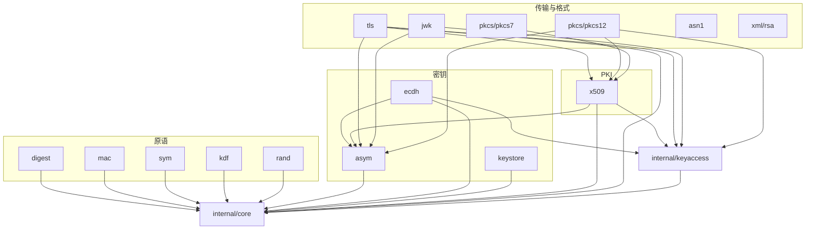

# 包结构重构路线图

> **用途**：记录本仓库 API 层**包结构重构**的全部决策、迁移方案、排期与验证方式。目标形态的逐符号清单见 [api-reference.md](api-reference.md)。
>
> **口径**：
> 1. 本文件是**包结构级**路线图；**能力级**（「CLI 有这个功能、本库有没有」）路线图见 [cli-comparison.md](cli-comparison.md) §8，两者互补、不重复；
> 2. 重构**只改包结构、公开签名与迁移路径**，不新增密码学能力；能力补全按 Phase 分批（见 §7）；
> 3. 所有「现状」结论均可在源码中校验（文件:行号）；所有「目标」签名以 [api-reference.md](api-reference.md) 为准；
> 4. 破坏性变更一次性完成（不保留 deprecated 转发包），配迁移对照表（见 §4）；
> 5. 基线：`0.3.0 - TBD`（CHANGELOG 待发段）。

---

## 0. 决策记录

| # | 决策项 | 结论 | 理由 |
|---|--------|------|------|
| 1 | 重构力度 | **一步到位迁移并删除旧包**，不做 deprecated 转发 | 转发层会让「公开面收敛」永远做不完；`0.3.0 - TBD` 尚未发布，可直接改 |
| 2 | 命名与层级 | **Go 惯例名 + 全部顶级**，`crypto/` 与 `key/` 取消 | 现有 `crypto/` 下既有算法也有组合层，边界已经模糊；扁平后职责清晰 |
| 3 | 对称包名 | `sym` | 与 `asym` 对称、3 字母等长；避免与标准库 `crypto/cipher` 同名 |
| 4 | `ec` 与 `ecdh` | **不拆**：曲线密钥生成归 `asym`，密钥协商归 `ecdh` | 避免为「曲线参数」单独建包 |
| 5 | 非对称包 | 单个 `asym`，按算法名分发 | 合并 `genpkey` / `pkey` / `pkeyutl` 三命令的职责 |
| 6 | `x25519` / `x448` | **删除包**：生成 → `asym`，协商 → `ecdh` | `ecdh.Curve` 已覆盖 OKP 曲线，独立包只剩重复 |
| 7 | `mac` 范围 | **仅 MAC**（HMAC / CMAC / GMAC / KMAC / SipHash / Poly1305 / EIA3） | 签名/验签归 `asym`；MAC 管「带密钥的摘要」 |
| 8 | `rand` / `kdf` | 各自保留顶级包 | 两者都是 CLI 子命令，且无更合适的归属 |
| 9 | PKI 家族 | **不拆**：`csr` / `crl` / `ocsp` 全部留在 `x509` | 见下方「循环依赖」说明 —— 拆分会引入 `x509` ↔ `crl` 环 |
| 10 | `key` 归宿 | 拆四块：`asym` + `sym` + `keystore` + `kdf` | 「各自抽象、各自实现」，不再有一个包同时持有对称与非对称 |
| 11 | Go 惯例接口 | **保留** `hash.Hash` / `cipher.Block` / `cipher.AEAD`，同时叠加 CLI 式按名入口 | 保住 Go 生态可组合性，又不丢「一次调用完成一件事」 |
| 12 | 内部类型泄露 | **E1 十二项全部收敛** | 公开签名不得出现 `internal/core` 类型；这是重构的硬约束 |
| 13 | 跨包取句柄 | **`internal/keyaccess` + 结构化接口断言**（无注册表） | 见 §5.2 |
| 14 | 命名收尾 | `tongsuo` → `meta`；`symmetric` → `sym` | 前者避免 `tongsuo-go/tongsuo` 的 stutter；后者见决策 3 |
| 15 | `pkcs/` | **不扁平**，保留 `pkcs/pkcs7`、`pkcs/pkcs12` | 为将来 `pkcs/#8` 等预留命名空间 |
| 16 | 版本归属 | 并入 **`0.3.0 - TBD`** | 该段尚未发布，破坏性变更可一次落地 |
| 17 | 路线图口径 | 全列（含需新增 cgo 绑定 / 需重编铜锁的项），实施分批 | 便于排期时不遗漏前置条件 |

### 关于决策 9（为什么 PKI 家族不拆）

拆分方案曾把 `x509` 拆为 `x509` + `csr` + `crl`（+ 把 `ocsp` 独立）。但：

- `x509.Store.AddCRL(*crl.CRL)` 需要 `crl` 包 → **`x509` 依赖 `crl`**
- `crl.NewBuilder(issuer *x509.Certificate)` 与 `crl.RevocationCheck(cert *x509.Certificate, …)` 需要 `x509` → **`crl` 依赖 `x509`**

**构成循环依赖，Go 无法编译。** 原单一包内不存在此问题，是拆包引入的。可选修法有三种（`AddCRL` 改吃字节 / 把 CRL 侧方法搬到 `crl` / 链验证独立成 `verify` 包），但都要付代价；决策定为**合回单包**，代价是 `x509` 包偏大 —— 用文件维度拆开（`x509.go` / `csr.go` / `crl.go` / `ocsp.go` / `name.go` / `store.go` / `helpers.go`）来缓解，与现有目录布局一致。

> 注：`ocsp → x509` 本身是**单向无环**，合并 OCSP 并非修环所必需；一并合并的目的是 PKI 家族收口、少一个包。

---

## 1. 现状与问题

### 1.1 现状（27 个 API 层包）

| 分组 | 现状包 |
|------|--------|
| 摘要 | `crypto/{sm3,md5,sha1,sha256,sha512}`（5 个包，各只有 `New` / `Sum` / `Size` / `BlockSize`） |
| MAC / KDF / 随机 | `crypto/hmac`、`crypto/kdf`（仅 HKDF/PBKDF2）、`crypto/rand` |
| 对称 | `crypto/aes`（仅 128/256 + ECB/CBC/CTR/GCM）、`crypto/sm4`（6 种模式） |
| 非对称 | `crypto/{sm2,rsa,ecdsa,ed25519,ed448,x25519,x448,ecdh}` |
| 密钥统合 | `key`（`Key` 接口 + 生成 + PEM + KDF + `Handle`/`Store`/轮转，11 个文件） |
| 证书与协议 | `x509`、`ocsp`、`tls` |
| 格式与容器 | `asn1`、`jwk`、`pkcs/pkcs7`、`pkcs/pkcs12`、`xml/rsa` |
| 内部 | `internal/{native,core,digest,testutil}` |

### 1.2 与目标形态的四处偏差

1. **CLI 式入口缺失**：每个算法是「一个包 + 一两个函数」，没有「算法名 + 输入 → 输出」的统一入口，使用者要自己串联多步（如自签证书需 `NewCertificate` + 10 个 `Set*` + `Sign`）。
2. **同能力双入口**：`key.GenerateRSAKey` 与 `crypto/rsa.GenerateKey`、`key.LoadPrivateKeyPEM` 与 `crypto/rsa.LoadPrivateKeyPEM` 是同一件事的两种写法。
3. **内部类型泄露**：20+ 处公开签名直接引用 `internal/core` 类型（`*core.PKey`、`*core.Digest`、`*core.KeyParams`、`*core.Certificate`、`*core.Store`），其中 `crypto/rsa.EncryptOAEP` 的 `md *core.Digest` 参数**外部根本无法构造**（本库未公开其构造函数）。
4. **命名不一致**：`x25519.SharedSecret` 与 `ecdh.(*PrivateKey).ECDH` 同义异名；`crypto/kdf` 没有 `Argon2ID` 派生函数（只有可用性探测），真正的派生在 `key.Argon2ID`。

### 1.3 目标形态定义

**「CLI 级应用函数」**：调用方给出输入与参数即可拿到输出，不必自行组装多步流程；对外**不提供底层函数、不暴露底层 cgo 句柄**。同时保留 Go 惯例接口（`hash.Hash` / `cipher.Block` / `cipher.AEAD`）以便与生态组合。

---

## 2. 目标包结构

### 2.1 包清单与 CLI 命令映射（16 个）

| # | 包 | 主要 CLI 命令 | 旧包来源 | 状态 |
|---|----|--------------|----------|------|
| 1 | `meta` | `version` / `info` / `errstr` / `list` | —（新增） | 🚧 |
| 2 | `digest` | `dgst`（摘要部分） | `crypto/{sm3,md5,sha1,sha256,sha512}` | 🚧 |
| 3 | `mac` | `mac` | `crypto/hmac` | 🚧 |
| 4 | `kdf` | `kdf` | `crypto/kdf` + `key` 的 KDF | 🚧 |
| 5 | `rand` | `rand` | `crypto/rand` | 🚧 |
| 6 | `sym` | `enc` | `crypto/{aes,sm4}` + `key` 对称部分 | 🚧 |
| 7 | `asym` | `genpkey` / `pkey` / `pkeyutl` | `crypto/{sm2,rsa,ecdsa,ed25519,ed448}` + `crypto/{x25519,x448}` 生成 + `key` 非对称部分 | 🚧 |
| 8 | `ecdh` | `pkeyutl -derive` | `crypto/ecdh` + `crypto/{x25519,x448}` 协商 | 🚧 |
| 9 | `keystore` | —（本库优势项，CLI 无） | `key` 的 `Handle`/`Store`/`Rotate` | 🚧 |
| 10 | `x509` | `x509` / `req` / `crl` / `ocsp` / `verify` | `x509` + `ocsp` | 🚧 |
| 11 | `tls` | `s_client` / `s_server` | `tls` | 🚧 |
| 12 | `asn1` | `asn1parse` | `asn1` | ✅ |
| 13 | `jwk` | —（CLI 无） | `jwk` | 🚧 |
| 14 | `pkcs/pkcs7` | `pkcs7` / `crl2pkcs7` | `pkcs/pkcs7` | ✅ |
| 15 | `pkcs/pkcs12` | `pkcs12` | `pkcs/pkcs12` | 🚧 |
| 16 | `xml/rsa` | —（CLI 无） | `xml/rsa` | ✅ |

**净减 11 个包**（27 → 16）。逐符号目标签名见 [api-reference.md](api-reference.md)。

### 2.2 依赖方向



- 算法原语包**不互相依赖**（`mac` 通过算法名字符串与 `digest` 对齐，不 import 它）
- 无环；`ecdh → asym` 单向；`asym` 不认识 `ecdh` / `x509`
- `tls` 不再直接 import `internal/native`（现状 `tls/{tls,suites,errors}.go` 直接引用绑定层，属分层违规，本轮修复）

### 2.3 `crypto/` 与 `key/` 的取消

- `crypto/` 下 18 个子包全部分流到 `digest` / `mac` / `sym` / `asym` / `ecdh` / `kdf` / `rand`
- `key/` 11 个文件按职责拆入 `asym`（`asymmetric.go` / `asym_generate.go` / `parse.go`）、`sym`（`symmetric.go` / `generate.go`）、`keystore`（`handle.go` / `store.go`）、`kdf`（`kdf.go`）
- **副作用（正向）**：`crypto/rand` 与标准库 `crypto/rand` 的「同路径」问题消失；`AGENTS.md` 陷阱 #6 可撤销

---

## 3. 逐包迁移方案

> 每节给：目标形态要点、迁移来源、需新增的底层绑定、CLI 对拍的锚点。完整符号清单见 [api-reference.md](api-reference.md)。

### 3.1 `meta`（新增）

- 承载 `version` / `info` / `errstr`（**零新增 cgo**）+ `list`（需新绑定）
- 实现要点：`internal/native` 的 `OpenSSLVersionText()` 目前把 `OpenSSL_version` 的 index **硬编码为 0**（`internal/native/binding_version.go:13`），需参数化为 `OpenSSLVersionWithIndex(idx int) string`，即可取到 `CFLAGS` / `BUILT_ON` / `PLATFORM` / `DIR` / `ENGINES_DIR` / `VERSION_STRING` / `MODULES_DIR` / `CPU_INFO` 全部构建信息
- CLI 对拍：`tongsuo version`、`tongsuo version -a` 逐行断言；`errstr` 用固定错误码断言文本

### 3.2 `digest`

- 合并 5 包 → 1 包；**新增 `SHA-224` / `SHA-384`**（`EVP_sha224` / `EVP_sha384` 与 `core.SHA224` / `core.SHA384` 均已存在，**零新增 cgo**）
- 尺寸常量必须加算法前缀（`Size` → `SM3Size` 等），否则合并后重名
- 保留 `hash.Hash` 惯例入口 + 新增按名分发（`Names` / `New` / `Sum` / `SumReader`）
- CLI 对拍：`tongsuo dgst -sm3 -hex`、`-sha224`、`-sha384` 逐字节比对；空输入与多块输入

### 3.3 `mac`

- 本版**只覆盖 HMAC**（沿用 legacy `HMAC_CTX_*` 路径），命名统一加 `HMAC` 前缀：`hmac.NewSM3` → `mac.NewHMACSM3`
- 补齐一次性入口：原只有 `SumSM3` / `SumSHA256` / `SumSHA384`，新增其余 4 种
- `New(name, …)` 在本版只接受 `HMAC-*`；CMAC/GMAC/KMAC/SipHash/Poly1305/EIA3 在 Phase 2 前置 `EVP_MAC_*` 绑定后补齐
- CLI 对拍：`tongsuo mac -macopt hexkey:… HMAC-SM3`（CLI 侧走 provider，本版走 legacy，需逐字节比对确认一致）

### 3.4 `kdf`

- 合并 `crypto/kdf`（仅 HKDF/PBKDF2）+ `key.{HKDF,PBKDF2,Argon2ID}`；`Hash` 类型与常量由 `key` 迁入
- `crypto/kdf.HKDF("SM3", …)` 这种「字符串摘要名」入口被 `Derive("HKDF", &Options{Digest: HashSM3, …})` 取代
- CLI 对拍：`tongsuo kdf -kdfopt digest:SM3 -kdfopt hexkey:… HKDF`；**注意** `crypto/kdf/kdf_tongsuocli_test.go:14-23` 记录过 Tongsuo 8.4 HKDF 与 CLI 输出不一致的 known bug，沿用其降级断言策略并保留说明

### 3.5 `rand`

- 仅改路径；新增 `Reader() io.Reader` 便于 `io.Copy`
- CLI 对拍：不可逐字节比对（随机性），改为断言长度与两次输出不同

### 3.6 `sym`

- 合并 `crypto/aes` + `crypto/sm4`；类型化入口加算法前缀（`aes.EncryptCBC` → `sym.EncryptAESCBC`）
- 尺寸常量统一：`sm4.KeySize` → `sym.SM4KeySize`，并**显式补出** AES 的 `AES128KeySize` / `AES256KeySize`（原来只是隐式约束）
- 从 `key` 迁入对称密钥对象：`SymmetricKey` / `AESKey` / `SM4Key` / `NewAESKey` / `NewSM4Key` / `GenerateSymmetricKey` / `ParseSymmetricKey`，并把 `key.Alg*` 的对称部分变成 `sym.Algorithm` 常量
- CLI 对拍：`tongsuo enc -sm4-ecb / -sm4-cbc / -aes-128-cbc / -aes-256-gcm`；SM4 已有对拍用例（`crypto/sm4/sm4_tongsuocli_test.go`），迁移后需覆盖全部 6 种模式 + AES 4 种

### 3.7 `asym`（最大改动面）

- 合并 `crypto/{sm2,rsa,ecdsa,ed25519,ed448}` + `crypto/{x25519,x448}` 的密钥生成 + `key` 的非对称部分
- **类型化函数由「方法」改为「包级函数」**（合并后无法为 7 种算法共用方法集）：
  `rsa.GenerateKey(2048)` → `asym.GenerateRSA(2048)`；`priv.SignPSS(…)` → `asym.SignPSS(priv, …)`
- 密钥类型对外只暴露接口 `PrivateKey` / `PublicKey`；**具体类型非导出**（见 §5.2）
- `asym` 提供 `GenerateKey(alg, *Options)` 按算法名统一入口（对应 `genpkey -algorithm`）
- `LoadPrivateKeyPEM` 补上 **EC SEC1 回退**（现状 `key.LoadPrivateKeyPEM` 只回退 RSA PKCS#1）
- `x25519` / `x448` 的 `PrivateKeyFromBytes` / `PublicKeyFromBytes` 合并为 `GenerateKeyFromSeed(alg, seed)` / `PublicKeyFromBytes(alg, raw)`
- CLI 对拍：`genpkey` 生成 → 本库加载；本库签名 → `pkeyutl -verify`；`pkeyutl -encrypt/-decrypt` 双向。RSA / SM2 / ECDSA / Ed25519 / Ed448 / X25519 / X448 各一组

### 3.8 `ecdh`

- 保留 `Curve` 与 `crypto/ecdh` 的语义；**删除 `(*Curve).GenerateKey()`**（生成统一走 `asym`）
- 新增对象入口：`LoadPrivateKey(asym.PrivateKey)` / `LoadPublicKey(asym.PublicKey)` —— 机制见 §5.2
- 把 `x25519.SharedSecret` / `x448.SharedSecret` 收为 `ecdh.SharedSecret(priv, peer)`
- 新增 `Curves()` / `CurveByName(name)`（对应 `ecparam -list_curves`）
- CLI 对拍：`pkeyutl -derive` 双向；已有用例 `crypto/ecdh/ecdh_tongsuocli_test.go` 可直接迁移（含按 provider 能力的 skip 分支）

### 3.9 `keystore`

- 只收 `key` 的 `Handle` / `Store` / `MemoryStore` / `Rotate` / `History` / `Close` 与 `ErrNotFound` / `ErrClosed`
- `Handle.Algorithm` 由 `key.Algorithm` 改为 `string`；`Handle.Key` 由 `key.Key` 改为 `any`（避免 `keystore` 反向依赖 `asym`/`sym`，算法已由 `Algorithm` 字段承载）
- **待定项**：若后续希望静态约束，可让 `asym` / `sym` 的 `Algorithm()` 返回 `string`，则 `keystore` 可定义 `type Key interface{ Algorithm() string }`
- 无 CLI 对拍（CLI 无对应命令）；用单元测试覆盖 CRUD / 轮转 / 历史版本

### 3.10 `x509`（合并 PKI 全家族）

- 收 `Certificate` / `Name` / `Extension` / `CertificateRequest` / `CRL` / OCSP / `Store` / `ChainVerify`
- **删除** `x509.PublicKey` / `x509.PrivateKey` 窄接口，公开签名一律直接用 `asym.PublicKey` / `asym.PrivateKey`
- **新增**（能力补全的一部分，随本版落地）：
  - `CreateSelfSigned(...)` — 一行自签证书（`req -x509`）
  - `VerifyHostname(host)` — 主机名 / IP 校验（`verify -verify_hostname`，cli-comparison §6.B B8）
  - `Store.SetTime(t)` — 指定验证时刻（`verify -attime`）
  - `NewCRLBuilder` / `CRLBuilder.Revoke` / `CRLBuilder.Sign` — 公开 CRL 签发入口（原 `internal/core.NewCRL` 未导出）
  - `CreateOCSPRequest` / `ParseOCSPResponse` — 原 `ocsp.CreateRequest` / `ParseResponse`，加 `OCSP` 前缀避免同包重名
- 同包重名处理：`ocsp.Good/Revoked/Unknown` → `x509.OCSPGood/OCSPRevoked/OCSPUnknown`；`crl.Builder` → `CRLBuilder`
- CLI 对拍：`req -x509` 生成的证书可被本库加载并 `ChainVerify` 通过；`crl -verify`；`ocsp` 用本地 responder 或固定响应 DER

### 3.11 `tls`

- `Config` 的 `Key` / `SignKey` / `EncKey` 由 `*sm2.PrivateKey` 改为 `asym.PrivateKey`
- **修复分层违规**：去掉 `internal/native` 直接 import，改经 `internal/core`
- 新增 `CipherSuiteByName(name)`（`ciphers -convert` / `-stdname`）与 `NewListener(config, ln)`（`net.Listener` 包装）
- CLI 对拍：保持现有 `tls_tongsuocli_test.go` 与 `openssl s_client` / `s_server` 双向互操作；NTLS 用例必须 **`-ntls` 与 `-enable_ntls` 同传**（AGENTS.md 陷阱 #1）

### 3.12 `asn1` / `pkcs/pkcs7` / `xml/rsa`（不动）

三包**不改签名**，仅需在测试与文档中确认无遗留引用（`pkcs7` 引用 `x509.Certificate`，类型身份不变）。

### 3.13 `jwk`

- `Marshal(key *core.PKey)` 移除（修复 E1-7），统一用 `MarshalKey(k asym.Key)`
- `MarshalKey` 参数由 `key.CoreKey` 改为 `asym.Key`
- CLI 对拍：本库导出 JWK → 转 PEM → `pkey -noout -text` 断言参数一致

### 3.14 `pkcs/pkcs12`

- 移除 `type PrivateKey = key.CoreKey` 别名（修复 E1-12），`Pack` 直接接受 `asym.PrivateKey`
- `Bundle.PrivateKey` 由 `*core.PKey` 改为 `asym.PrivateKey`
- CLI 对拍：`pkcs12 -export` 产物 ↔ 本库 `Parse`；本库 `Pack` ↔ `pkcs12 -info`（含 `-passin` / `-passout`）

---

## 4. 全量符号级迁移对照

| 旧调用 | 新调用 |
|--------|--------|
| `sm3.New()` / `sm3.Sum(d)` | `digest.NewSM3()` / `digest.SumSM3(d)`（或 `digest.New("SM3")` / `digest.Sum("SM3", d)`） |
| `sha256.Sum256(d)` | `digest.SumSHA256(d)` |
| `hmac.NewSM3(k)` / `hmac.SumSM3(k, d)` | `mac.NewHMACSM3(k)` / `mac.SumHMACSM3(k, d)` |
| `aes.NewCipher(k)` | `sym.NewAESCipher(k)` |
| `sm4.EncryptCBC(k, iv, d)` | `sym.EncryptSM4CBC(k, iv, d)` |
| `kdf.HKDF("SM3", s, salt, info, n)` | `kdf.Derive("HKDF", &kdf.Options{Digest: kdf.HashSM3, Secret: s, Salt: salt, Info: info, Length: n})` |
| `key.HKDF(key.HashSM3, …)` | `kdf.HKDF(kdf.HashSM3, …)` |
| `rand.Bytes(n)` | `rand.Bytes(n)`（仅路径由 `crypto/rand` 变 `rand`） |
| `rsa.GenerateKey(2048)` | `asym.GenerateRSA(2048)`（或 `asym.GenerateKey(asym.AlgRSA, &asym.Options{Bits: 2048})`） |
| `sm2.GenerateKey()` | `asym.GenerateSM2()` |
| `ecdsa.GenerateKey("prime256v1")` | `asym.GenerateEC("prime256v1")` |
| `ed25519.PrivateKeyFromSeed(seed)` | `asym.GenerateKeyFromSeed(asym.AlgEd25519, seed)` |
| `x25519.GenerateKey()` | `asym.GenerateX25519()` |
| `x25519.SharedSecret(priv, peer)` | `ecdh.SharedSecret(ePriv, ePeer)`（先 `ecdh.LoadPrivateKey` / `LoadPublicKey`） |
| `key.LoadPrivateKeyPEM(p)` | `asym.LoadPrivateKeyPEM(p)` |
| `key.LoadPublicKeyPEM(p)` | `asym.LoadPublicKeyPEM(p)` |
| `key.Close(k)` | `keystore.Close(h)` 或 `(*asym.PrivateKey).Close()` |
| `key.NewMemoryStore()` | `keystore.NewMemoryStore()` |
| `x509.NewCertificateRequest(...)` | `x509.NewCertificateRequest(...)`（名字不变，包不变） |
| `x509.ParseCRL(d)` | `x509.ParseCRL(d)`（名字不变，包不变） |
| `ocsp.CreateRequest(c, i, h)` | `x509.CreateOCSPRequest(c, i, h)` |
| `ocsp.ParseResponse(d, c, i)` | `x509.ParseOCSPResponse(d, c, i)` |
| `rsa.EncryptOAEP(pub, d, core.SHA256())` | `asym.EncryptOAEP(pub, d, "SHA256")` |
| `(*rsa.PrivateKey).Params()` | `asym.Params(priv)` → `*asym.KeyParams` |
| `x509.Certificate.PublicKeyPKey()` | `x509.Certificate.PublicKey()` → `asym.PublicKey` |
| `jwk.Marshal(corePKey)` | `jwk.MarshalKey(asymKey)` |

---

## 5. 内部类型泄露收敛（E1 十二项）

### 5.1 逐项处置

| # | 现状签名中的泄露 | 收敛方式 |
|---|-----------------|----------|
| E1-1 | `key.CoreKey`（公开接口，被 `jwk` / `pkcs12` 使用） | 删除接口；`jwk.MarshalKey` 收 `asym.Key`，`pkcs12.PrivateKey` 别名改为 `asym.PrivateKey` |
| E1-2 | `rsa.EncryptOAEP(pub, data, md *core.Digest)` / `DecryptOAEP` | 参数改 `hash string`（外部本来无法构造 `*core.Digest`） |
| E1-3 | `(*PrivateKey).Params() *core.KeyParams` | 改为公开类型 `*asym.KeyParams` |
| E1-4 | 8 个包的 `Key() *core.PKey`（约 16 处） | 全部删除；跨包取句柄走 `internal/keyaccess` |
| E1-5 | `Match(other *core.PKey) bool` | 参数改 `Key` |
| E1-6 | `sm2.PublicKeyFromPKey(*core.PKey)` | 删除 |
| E1-7 | `jwk.Marshal(*core.PKey)` | 删除，统一 `MarshalKey` |
| E1-8 | `x509.Certificate.Core()` | 删除 |
| E1-9 | `x509.PublicKeyPKey()` / `csr.PublicKeyPKey()` | 合并为 `PublicKey() (asym.PublicKey, error)` |
| E1-10 | `x509.Store.Core()` | 删除 |
| E1-11 | `x509.PublicKey` / `x509.PrivateKey` 窄接口 | 删除接口，直接用 `asym.PublicKey` / `asym.PrivateKey` |
| E1-12 | `pkcs12.PrivateKey = key.CoreKey` 别名 + `Bundle.PrivateKey *core.PKey` | 别名删除；字段改 `asym.PrivateKey` |

收敛后 **公开签名中不再出现任何 `internal/` 类型**。

### 5.2 跨包取原生句柄：`internal/keyaccess` + 结构化接口断言

**问题**：`ecdh` / `x509` / `tls` / `jwk` / `pkcs12` 必须先拿到 `*core.PKey`（`EVP_PKEY_derive`、`X509_set_pubkey`、`X509_sign`、`PEM_write_PrivateKey` …），但 `asym` 把它放在非导出字段里。且不能在 `internal/core` 里写「类型开关」—— `internal/core` 位于依赖最底层，无法 import `asym`（会成环）。

**方案（无注册表）**：

1. `asym` 密钥的**具体类型一律非导出**（`*privateKey` / `*publicKey` …），对外只返回 `PrivateKey` / `PublicKey` 接口；
2. 具体类型上实现导出方法 `func (k *privateKey) CorePKey() *core.PKey` —— 因**宿主类型非导出**，该方法不出现在 godoc；
3. 该方法**不得**出现在任何导出接口中（否则即成为公开 API）；
4. `internal/keyaccess` 只声明形状 `interface{ CorePKey() *core.PKey }` 并提供 `PKey(v any) (*core.PKey, bool)`，靠 Go 的**结构化接口满足**做类型断言；
5. 消费方取到句柄后用 **`EVP_PKEY_dup`** 复制，保证与原密钥生命周期独立（否则 `asym` 侧 `Close()` 后 `ecdh` 侧即为悬垂指针）。

**为何优于反向注册表**：无全局可变状态、无 `init()` 顺序依赖、无并发写入、契约由类型系统隐式校验（改签名立刻在断言处暴露）。`asym` 本身**不需要** import `keyaccess`。

**残余瑕疵（已接受）**：外部包可以写匿名接口断言 `k.(interface{ CorePKey() *core.PKey })` 并调用成功，但拿到的是 `*core.PKey`，而它无法 import `internal/core`，因此**拿到也无法使用**。若要连这点也消除，唯一替代是「DER 往返」（`MarshalDER` → `d2i_PrivateKey`），代价是加载时一次编解码 —— 已评估，本版不采用。

**验收**：`go doc -all ./asym` 输出中不得出现 `CorePKey`；`grep -rn "keyaccess" --include=*.go` 只应命中 `internal/keyaccess/` 与 5 个消费方。

---

## 6. 需新增的底层绑定

### 6.1 档位一：现有绑定即可实现（零新增 cgo）

| 目标 | 依据 |
|------|------|
| `digest` 的 SHA-224 / SHA-384 | `EVP_sha224` / `EVP_sha384`、`core.SHA224()` / `core.SHA384()` 均已存在 |
| `meta` 的版本 / 构建信息 | 仅需把 `OpenSSL_version` 的 index 参数化（`binding_version.go:13`） |
| `meta` 的错误码解析 | `native.ErrorString` / `ErrGetLib` / `ErrGetReason` 已存在 |
| `asym.LoadPrivateKeyPEM` 的 EC SEC1 回退 | `X_PEM_read_bio_PrivateKey` 已能读 SEC1，只是 Go 侧未回退 |
| `x509.VerifyHostname` / `Store.SetTime` / `CreateSelfSigned` | `X509_VERIFY_PARAM_*` / `X509_STORE_CTX_set_time` / 现有 `X509_*` 组合 |
| `x509.CRLBuilder` | `internal/core.NewCRL` 等已实现，仅未导出 |
| `tls.NewListener` | Go 侧实现 |

### 6.2 档位二：需新增 cgo 绑定

| 家族 | 需要的 C 接口 | 服务对象 |
|------|--------------|----------|
| MAC | `EVP_MAC_fetch` / `new` / `init` / `update` / `final` | `mac` 的 CMAC / GMAC / KMAC-128/256 / SipHash / Poly1305 / EIA3 |
| AES-192 | `EVP_aes_192_{ecb,cbc,ctr,gcm}` | `sym` |
| AES 扩展模式 | `EVP_aes_*_{ofb,cfb,ccm,xts,ocb,siv,wrap,cbc-cts}` | `sym` |
| SM4 扩展模式 | `EVP_sm4_ccm` / `EVP_sm4_xts` | `sym` |
| 流密码 | `EVP_chacha20` / `EVP_chacha20_poly1305` / `EVP_zuc` | `sym` |
| KDF | 现有 shim 仅 `HKDF` / `PBKDF2`；其余 10 种需 `EVP_KDF_fetch(alg)` 泛化 | `kdf` |
| 算法枚举 | `EVP_{MD,CIPHER,MAC,KDF,SIGNATURE,KEYEXCH,KEM}_do_all_provided` | `meta` |
| Provider | `OSSL_PROVIDER_*` | `meta` |
| 环境信息 | `OPENSSL_info(OPENSSL_INFO_SEED_SOURCE)` | `meta` |
| TLS 组 | `SSL_get1_groups` / `SSL_group_to_name` | `meta` |
| TLS 深度 | `SSL_CTX_set_alpn_protos` / `SSL_get0_alpn_selected`、`SSL_SESSION_*`、`SSL_CTX_set_client_CA_list`、`SSL_CTX_set_tlsext_servername_callback` | `tls` |
| KEM | `EVP_PKEY_encapsulate` / `EVP_PKEY_decapsulate` | `asym` |
| 上下文签名 | `EVP_DigestSignInit_ex` 的 `context-string` | `asym` 的 ED25519ph / ctx |
| PKCS#7 签名族 | `PKCS7_sign` / `PKCS7_verify` / `PKCS7_encrypt` / `PKCS7_decrypt`、`PKCS7_set_type`（后者已绑定） | `pkcs/pkcs7` |
| CMS / TS | `CMS_*` / `TS_*` | 规划中（见 §11） |
| OCSP nonce | `OCSP_REQUEST_add1_nonce` / `OCSP_check_nonce` | `x509` |

### 6.3 档位三：需重编铜锁方可验证（本机构建未启用）

白盒 SM4（`wbsm4` / `wbsm4kdf`）、Bulletproofs（`bulletproofs`）、SM2 门限签名 / 解密（`sm2_threshold`）、SDF 密码设备接口（`sdf`）、SMTC 模块管理（`mod`）、Delegated Credential（`decred`）。

这些**不写入实施排期**；只在 [cli-comparison.md](cli-comparison.md) §6.D 保留「需重编铜锁方可验证」的标注。

---

## 7. Phase 与版本归属

### Phase 0 — 基础设施（与 Phase 1 同版本）

| 项 | 说明 |
|----|------|
| `internal/keyaccess` | 新建叶子包 + `asym` 侧契约（§5.2） |
| `internal/testutil` 收敛 | 现状 25 个 `*_tongsuocli_test.go` 中 14 处各自复制 `runOpenSSL`，且仅 5 个用了 `SkipIfNoOpenSSL`；统一为单一签名并补齐 skip 分支 |
| CI 增加 `tongsuocli` job | 现状 CI 只跑 `go vet` / `go build` / `go build -tags static` / `go test`；新包的价值就是 CLI 对拍，不进 CI 等于没验证 |

### Phase 1 — 包骨架与迁移（`0.3.0`）

- 16 个包的骨架与全部迁移（§3），E1 十二项收敛（§5.1）
- `meta` 的 `version` / `info` / `errstr`；`digest` 补 SHA-224/384；`ecdh` 的 `LoadPrivateKey`/`LoadPublicKey`；`x509` 的 `CreateSelfSigned`/`VerifyHostname`/`SetTime`/`CRLBuilder`
- 同步全部文档（§9）+ CHANGELOG 的 `### BREAKING / 已知限制` 段与迁移指南

### Phase 2 — CLI 能力补全

| 版本 | 内容 |
|------|------|
| `0.4.0` | `mac` 的 CMAC/GMAC/KMAC/SipHash/Poly1305/EIA3；`sym` 的 AES-192、SM4-CCM/XTS、ChaCha20(-Poly1305)；`kdf` 的 scrypt/SSKDF/TLS1-PRF/X9.42/KBKDF；`meta` 的算法枚举与 provider；`tls` 的 `NewListener` |
| `0.5.0` | `digest` 的 SHA-512/224·256、SHA3、SHAKE、KECCAK；`sym` 的 AES 扩展模式与 ZUC；`x509` 的 OCSP HTTP 与 nonce、`x509toreq`；`jwk` 的 OKP / oct；`pkcs7` 的 `crl2pkcs7`；`pkcs12` 的 PBE/iter 选项 |
| `0.6.0` | `asym` 的 ED25519ph/ctx、ML-DSA、SLH-DSA、KEM；`ecdh` 的 SM2DH；`pkcs7` 的签名/加密族 |
| `0.7.0` | CMS、`ts`、`ca` 工作流（形态待定） |

> 与 [cli-comparison.md](cli-comparison.md) §8「版本归属建议」的关系：该文按**能力**排期（`0.4.0` = Phase 1 全部 + Phase 2 起步），本文件按**包结构**排期。两者合并后以 `0.4.0` 起为「能力补全」区间；`0.3.0` 只做结构重构与少量顺带补全，不引入需新增 cgo 的能力。

---

## 8. 验证方案

### 8.1 每一步必须跑

```bash
gofmt -l .                  # 应为空
go vet ./...                # 必须 0 输出
go build ./...              # 必须成功
go build -tags static ./... # Linux；涉及绑定层改动时
go test -count=1 ./...      # 必须 ok
go test -tags tongsuocli ./...   # 涉及 CLI 对拍时
go test -race ./...              # 涉及并发 / 生命周期时
THRESHOLD=80 ./scripts/check-coverage.sh   # 逐包门禁
```

### 8.2 逐包验收清单

对 16 个包逐个核对：

- [ ] `{file}.go` + 包级双语 doc（`// Package xxx 中文` + 空 `//` + 英文段）
- [ ] 导出符号双语段式注释（中文段在前、英文段在后；`Example*` 含 `// Output:` 且紧贴函数体）
- [ ] `*_test.go`：标准向量 + 往返 + 边界 + 错误路径（按 [testing-guide.md](testing-guide.md) §3–§5）
- [ ] `example_test.go`：至少一个可运行 `Example*`
- [ ] `*_tongsuocli_test.go`：`//go:build tongsuocli`，缺 CLI 时用 `SkipIfNoOpenSSL` 跳过并说明原因
- [ ] 无 `import "C"`（只允许 `internal/native`）
- [ ] 不 import `internal/native`
- [ ] 公开签名中无 `internal/` 类型

### 8.3 迁移完整性校验

```bash
# 旧包路径应彻底消失（只允许出现在 docs 的「旧包来源」列）
grep -rn '"github.com/blue-cloud-net/tongsuo-go/crypto/' --include=*.go .
grep -rn '"github.com/blue-cloud-net/tongsuo-go/key"' --include=*.go .

# E1 收敛校验
grep -rn '\*core\.\(PKey\|Digest\|KeyParams\|Certificate\|Store\)' --include=*.go --exclude-dir=internal .
go doc -all ./asym | grep -c CorePKey     # 应为 0

# 桥接消费方白名单
grep -rln 'internal/keyaccess' --include=*.go .
```

### 8.4 CI 变更

- 新增 `tongsuocli` job（`go test -tags tongsuocli -count=1 ./...`），只跑 `crypto` 已迁出的包与 `x509` / `tls` / `jwk` / `pkcs/*`
- 保留 `-race` 在 main 分支的稳定性 job（可选）

---

## 9. 文档同步清单

| 文件 | 改动 |
|------|------|
| `docs/api-reference.md` | **已改**：16 包三态清单 + §0.1 迁移对照 |
| `docs/api-reference-internal.md` | **已改**：+ `§5 internal/keyaccess`，分层图与包数更新 |
| `docs/architecture.md` | **已改**：§1.1 / §2 / §3.3（含 keyaccess 小节）/ §4 / §5 目录树 / §7 / §10 / §11 |
| `docs/refactor-roadmap.md` | **本文件**（新增） |
| `AGENTS.md` | §3.2 目录地图、§3.3 分层红线、§7 同步表、§8 陷阱清单（#6 撤销/#9 复核）、§9.3 对齐清单、附录路径速查 |
| `README.md` + `README.zh.md` | Features 列表、Code Examples、Architecture 段（成对） |
| `CHANGELOG.md` + `CHANGELOG.zh.md` | `0.3.0 - TBD` 段加 `### BREAKING / 已知限制` 与 `### 文档` 条目（成对） |
| `docs/testing-guide.md` | §3–§7 用例表改新包名；补 `mac` / `sym` / `asym` / `ecdh` / `kdf` / `rand` 的对拍要求 |
| `docs/cli-comparison.md` | §8 加指向本文件的互引 |
| `docs/cli-comparison-todo.md` | §0 与附录 A 的「需新增包」改为指向本文件 |
| `docs/official-sdk-comparison.md` | §8 加互引 |

---

## 10. 风险与回滚

| 风险 | 影响 | 缓解 |
|------|------|------|
| 破坏性变更面大（27 → 16 包、所有 `crypto/*` import 失效） | 使用者需大改 | CHANGELOG 写 `BREAKING` + §4 迁移对照表；`examples/` 6 个示例同步改 |
| `asym` 包体量大（7 种算法 + 3 类运算） | 单文件膨胀 | 按算法拆文件（`rsa.go` / `sm2.go` / `ec.go` / `ed.go` / `xdh.go`） |
| `x509` 合并后偏大 | 同上 | 按载体拆文件（见 §2.1 说明） |
| `internal/keyaccess` 的导出方法被外部断言 | 理论上的「弱泄露」 | 见 §5.2「残余瑕疵」；验收用 `go doc` 检查 |
| `EVP_PKEY_dup` 遗漏导致悬垂句柄 | 崩溃 | 写进 `ecdh` / `x509` 用例：`asym` 侧 `Close()` 后 `ecdh` 侧仍可协商 |
| 简化 token 不可用（如未来 HSM 密钥） | 某些路径失效 | 本版只处理进程内生成的密钥；接 HSM 时改走 PEM/DER 往返 |

**回滚**：本重构为单次提交序列，回滚 = `git revert` 对应 commit；不涉及数据格式变更（PEM/DER/JWK 输出不变）。

---

## 11. 明确不做

| 项 | 理由 |
|----|------|
| 保留 `crypto/*` deprecated 转发包 | 转发层会让公开面收敛永远做不完 |
| `ca` 式数据库化 CA 工作流 | 本质是文件系统状态机，与内存模型冲突；形态待定 |
| DSA / DH / EC-ElGamal / Paillier | 非国密目标场景（见 [cli-comparison.md](cli-comparison.md) §9） |
| 需重编铜锁方可验证的六项（§6.3） | 本机构建未启用，无法验证 |
| 把 `internal/core` 的类型提升为公开句柄 | 与 E1 收敛目标冲突（已评估，未采用） |
| `crypto/cipher` 式包名 | 与标准库 `crypto/cipher` 同名，import 混淆 |

---

## 12. 执行序列与决策锁定（2026-09-24）

> 本节是**实施侧**的执行计划，**不重复** §0–§11 的设计内容；与 §0 决策记录互补——§0 写「做什么 / 为什么」，本节写「按什么顺序做 / 每一刀切在哪」。
> 实施过程回填于 §13。

### 12.1 决策锁定（与用户拍板定稿）

| # | 决策项 | 结论 | 与 §0 / §3 的差异 |
|---|--------|------|------------------|
| D1 | 提交粒度 | **更细：22 个 commit**（§12.2 全序列） | §7 把 16 包骨架压成一个 `0.3.0` 版本；本节按用户偏好拆细，使每步可独立编译/vet/test 通过 |
| D2 | `asym` 拆分方式 | **按算法拆 7 个小 commit**（sm2 / rsa / ecdsa / ed25519 / ed448 / x25519 / x448 各一） | §3.7 暗示「一次合 7 种算法」；本节按用户偏好按算法拆分。**E1 硬约束在 commit 03 已满足**：因为 `asym.PrivateKey`/`PublicKey` 一开始就是接口 + 具体类型非导出，`CorePKey()` 因宿主类型不导出而不出现在 godoc，无「中间态暴露」 |
| D3 | CHANGELOG 版本归属 | **塞进现有 `0.3.0 - TBD` 段**，不另开 `0.4.0` | §7 与本节一致；既有 `feat(core-pkey)` / `feat(jwk)` / `test(crypto-rsa)` / `refactor(xml-rsa)` 4 条保留不动，本次重构的 `BREAKING` / `文档` 子段**追加在它们之后** |
| D4 | Tongsuo CLI 路径 | **不加 PATH，直接用 `/opt/tongsuo/bin/openssl` 绝对路径** | `internal/testutil/openssl.go` 的 `defaultBin` 已是这条路径；环境实测 `/opt/tongsuo/lib64/libcrypto.so*` 与 `libssl.so*` 齐备，`LD_LIBRARY_PATH` 默认可达（commit 02 起每步跑 `go build` / `go test` 前不需任何额外 export） |

### 12.2 22 步执行序列

```
01 docs(refactor-plan): 在 roadmap 末尾追加 §12 执行序列与决策锁定   [本 commit]
02 refactor(native-binding): OpenSSL_version index 参数化为 OpenSSLVersionWithIndex
03 feat(internal-keyaccess): 新建桥接包 + asym 侧契约占位接口
04 feat(meta): 新建 meta 包（version / build info / errstr）
05 feat(digest): 合并 sm3+md5+sha1+sha256+sha512，补 SHA-224/384
06 feat(mac): 命名规范化（NewHMACSM3 等）+ 补齐 6 种 Sum*
07 feat(kdf): 合并 HKDF/PBKDF2/Argon2ID
08 feat(rand): 路径迁移 + Reader()
09 feat(sym): 合并 AES+SM4 + 密钥对象（key 对称部分迁入）
10 feat(asym-sm2): 迁 sm2 + 同步 jwk/pkcs12 对 sm2 的引用
11 feat(asym-rsa): 迁 RSA + 同步 jwk/pkcs12 对 RSA 的引用 + xml/rsa
12 feat(asym-ecdsa): 迁 ECDSA（含 NIST 曲线）+ 同步消费方
13 feat(asym-ed25519): 迁 Ed25519 + 同步消费方
14 feat(asym-ed448): 迁 Ed448 + 同步消费方
15 feat(asym-x25519): 迁 x25519 生成（协商留 ecdh）
16 feat(asym-x448): 迁 x448 生成（协商留 ecdh）
17 feat(ecdh): 收 x25519/x448 协商 + 加 LoadPrivateKey/LoadPublicKey
18 feat(keystore): 从 key 拆 Handle/Store/Rotate
19 feat(x509): 合并 ocsp + 公开 CRLBuilder/CreateSelfSigned/VerifyHostname
20 feat(tls): 去 internal/native 直接 import + 改 Key 类型为 asym
21 chore(refactor): 删除旧 crypto/* + key/* + ocsp 包
22 docs+changelog: 同步 architecture/api-reference/testing-guide +0.3.0 BREAKING 段
```

### 12.3 与设计侧的差异（实施期易踩坑处）

1. **commit 03 提前于 commit 04–22**：§3 各包都依赖 `internal/keyaccess`，必须先建桥接包与 `asym` 侧的契约占位接口（即使 `asym` 包本身还没建）；否则 `ecdh` / `x509` / `tls` / `jwk` / `pkcs12` 的取句柄路径无着落。
2. **commit 10–16 的 `jwk` / `pkcs12` 修复并入 asym 对应 commit**：原计划「13. refactor(jwk) / 14. refactor(pkcs12)」作为独立 commit，会在「asym 改完签名但 jwk 还没改」期间留下编译红；并入后每步可直接 `go build ./...` 通过。
3. **commit 21 一次性删旧包**：旧 `crypto/*`（17 个）+ `key/` + `ocsp/` 在删完后才能看到「16 个顶级包」目标形态；此 commit 是「公开面收敛完成」的唯一时刻，故 `BREAKING` 条目在 commit 22 的 CHANGELOG 才正式登台（commit 22 是发版 commit）。
4. **commit 22 是发版 commit**：除文档同步外，还做 `git tag v0.3.0`（不实际推送，仅本地标记）；`scripts/extract_release_notes.py` 跑通即视为发版就绪。

### 12.4 每 commit 提交前自检（AGENTS.md §9.2）

```bash
gofmt -l .                  # 应为空
go vet ./...                # 必须 0 输出
go build ./...              # 必须成功
go build -tags static ./... # 涉及 cgo/绑定层时（commit 02/03/04 等）
go test -count=1 ./...      # 必须 ok
go test -tags tongsuocli ./... # 涉及 CLI 对拍时（commit 04–19）
go test -race ./...         # 涉及并发/生命周期时（commit 19/20）
```

### 12.5 禁区（AGENTS.md §6.5 / §10 再次明示）

- ❌ `git push`、`git reset --hard`、`git rebase`、删未提交改动
- ❌ 把铜锁源码 / 预编译库 / `tongsuo` 二进制塞进仓库
- ❌ 引入第三方依赖（`go.mod` 只允许标准库 + cgo）
- ❌ 改测试期望值或放宽断言来「通过」

---

## 13. 执行进度

> 每完成一个 commit 回填一行；commit 22 完成后整张表定格。
> 状态：`✅ 已提交` / `🚧 进行中` / `⏸ 暂停` / `❌ 回滚`。

| # | commit | 状态 | 备注 |
|---|--------|------|------|
| 01 | `docs(refactor-plan): 在 roadmap 末尾追加 §12` | ✅ | 本节 |
| 02 | `refactor(native-binding): 参数化 OpenSSL_version 调用` | ✅ | （+41 行） |
| 03 | `feat(internal-keyaccess): 新建桥接包 + core.(*PKey).Dup` | ✅ | （+203 行；4 文件：2 新建 + 2 改） |
| 04 | `feat(meta): 新建铜锁元信息查询包` | ✅ | （+429 行；7 文件：6 新建 + 1 改） |
| 05 | `feat(digest): 合并 5 个摘要包并补 SHA-224/384` | ✅ | （+1224 行；7 文件纯新增） |
| 06 | `feat(mac): 命名规范化并补齐 HMAC 全家族` | ✅ | （+953 行；7 文件纯新增） |
| 07 | `feat(kdf): 合并 HKDF/PBKDF2/Argon2ID` | ✅ | （+498 行；5 文件纯新增） |
| 08 | `feat(rand): 路径迁移 + Reader()` | ✅ | （+299 行；4 文件纯新增） |
| 09 | `feat(sym): 合并 AES+SM4 + 密钥对象 + GCM 按名分发` | ✅ | （+2028 行；10 文件纯新增；crypto/aes + crypto/sm4 + key/symmetric.go 未删除，留给 commit 21） |
| 10 | `feat(asym-sm2): 新建 asym 包并实现 SM2 完整入口` | ✅ | （+约 1500 行；6 文件纯新增；jwk/pkcs12 实际不引用 sm2 类型，example_test.go 保留 crypto/sm2 直至 commit 19 x509 收紧窄接口） |
| 11 | `feat(asym-rsa): 在 asym 包下实现 RSA 全家族入口` | ✅ | （+约 1000 行；4 文件纯新增；SM2 Load* 重命名为 LoadSM2*PrivateKeyPEM/LoadSM2*PublicKeyPEM 以让位；crypto/rsa 暂保留） |
| 12 | `feat(asym-ecdsa): 在 asym 包下实现 ECDSA 与 NIST 曲线族` | ✅ | （+约 850 行；4 文件纯新增；含 CurveP256/P384/P521/Secp256k1 常量；SM2 曲线名被显式拒绝并指向 GenerateSM2；crypto/ecdsa 暂保留） |
| 13 | `feat(asym-ed25519): 在 asym 包下实现 Ed25519 与原始种子入口` | ✅ | （+约 900 行；4 文件纯新增；新增 GenerateKeyFromSeed / PublicKeyFromBytes / RawPrivateKey / RawPublicKey 四件通用入口；errors.go 增 ErrInvalidSeedLength / ErrInvalidPublicKeyLength；crypto/ed25519 暂保留） |
| 13.5 | `refactor(asym): 算法无关入口去前缀并消除 internal 类型泄漏` | ✅ | （落实 roadmap §4 的 `asym.LoadPrivateKeyPEM` / `asym.LoadPublicKeyPEM` / `asym.Params → *asym.KeyParams`；新增 load.go + keyparams.go；§5.2 验收 `go doc -all ./asym \| grep -c CorePKey` 归零） |
| 14 | `feat(asym-ed448): 在 asym 包下实现 Ed448 与 57 字节种子入口` | ✅ | （+约 700 行；4 文件纯新增；GenerateKeyFromSeed / PublicKeyFromBytes 增 AlgEd448 分支；load.go 分发增 *ed448PrivateKey/*ed448PublicKey；RFC 8032 §7.4 Blank 向量逐字节通过；crypto/ed448 暂保留） |
